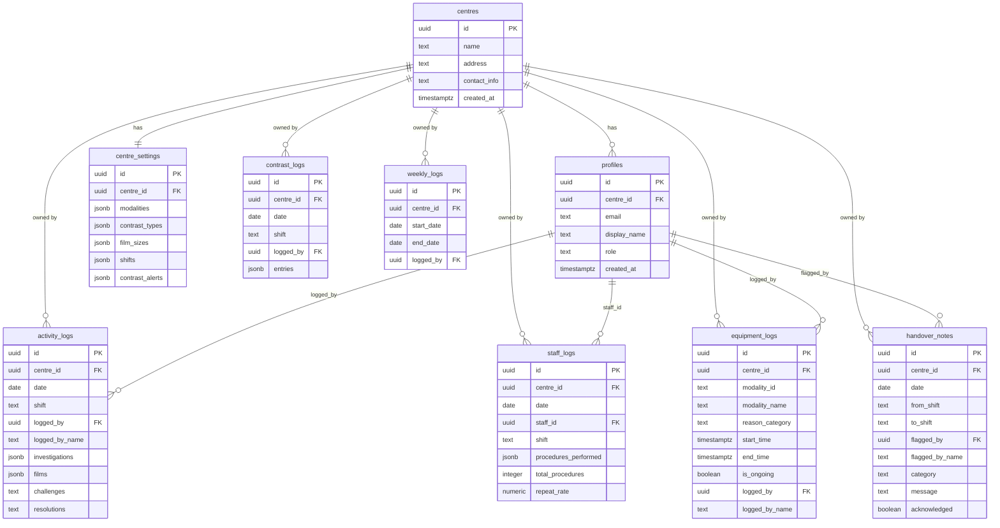

# RadPadi — Architecture Reference

> Last updated: 2026-03-02

---

## 1. Database Schema



---

## 2. Auth Flow

```
Browser
  │
  ▼
Login page
  │  User selects role (demo) OR enters email+password
  │
  ▼
AuthContext.login()  →  supabase.auth.signInWithPassword()
  │
  ▼
onAuthStateChange → fetchAndSetUserProfile(userId)
  │
  │  SELECT id, name, role, centre_id
  │  FROM profiles WHERE id = auth.uid()
  │
  ▼
User object: { id, name, role, email, centre_id }
  │
  ├── Stored in AuthContext state
  │
  ▼
useCentre() hook (priority resolution)
  1. user.centre_id          ← real Supabase auth
  2. centreSettings.centre_id ← RLS-filtered centre_settings row
  3. 'unknown'               ← misconfiguration fallback
  │
  ▼
All write operations use centreId from useCentre()
All read operations are scoped by RLS automatically
```

---

## 3. Role-Based Access Matrix

| Feature | `radiology_user` | `admin` |
|---|---|---|
| View Dashboard | ✅ | ✅ |
| Daily Logging (activity + contrast) | ✅ | ✅ |
| Staff Activity — own logs | ✅ | ✅ |
| Report Downtime | ✅ | ✅ |
| Handover — flag items | ✅ | ✅ |
| Reports — view analytics | ✅ | ✅ |
| Staff Activity — all staff (admin view) | ❌ | ✅ |
| Handover Timeline (admin view) | ❌ | ✅ |
| Settings (all tabs) | ❌ | ✅ |
| Invite / manage staff roles | ❌ | ✅ |

> Role is stored in `profiles.role` and enforced via React (`user.role === 'admin'`) for UI and Supabase RLS for data.

---

## 4. Multi-Centre Data Isolation

### Strategy: RLS via `get_user_centre_id()`

All operational tables (`activity_logs`, `contrast_logs`, `staff_logs`, `equipment_logs`, `handover_notes`, `weekly_logs`, `centre_settings`) have **Row Level Security enabled** with policies that call:

```sql
CREATE OR REPLACE FUNCTION get_user_centre_id()
RETURNS UUID AS $$
  SELECT centre_id FROM profiles WHERE id = auth.uid()
$$ LANGUAGE sql SECURITY DEFINER STABLE;
```

This means:
- A `SELECT * FROM activity_logs` query **automatically returns only rows for the logged-in user's centre** — no frontend filtering needed
- Writes are rejected by Supabase if `centre_id` doesn't match the user's centre
- No cross-centre data leakage is possible at the database layer

### Frontend `useCentre()` Hook

```ts
// src/hooks/useCentre.ts
export function useCentre() {
  const { user } = useAuth();
  const { centreSettings } = useAppContext();

  const centreId =
    user?.centre_id ??          // from profiles table (real auth)
    centreSettings?.centre_id ?? // from RLS-filtered centre_settings row
    'unknown';                   // misconfiguration fallback

  const centreName = centreSettings?.name ?? 'Radiology Centre';
  return { centreId, centreName, centreSettings };
}
```

Used in: `DailyLogging`, `StaffActivity`, `DowntimeModal`

### Hardcoded Reference Audit Results

| File | Status |
|---|---|
| `DailyLogging.tsx` | ✅ All refs use `centreId` / `centreName` |
| `StaffActivity.tsx` | ✅ Uses `centreId` |
| `DowntimeModal.tsx` | ✅ Uses `centreId` |
| `HandoverBanner.tsx` | ✅ No hardcoded refs |
| `HandoverComposer.tsx` | ✅ No hardcoded refs |
| `AppContext.tsx` | ✅ Reads scoped by RLS |

---

## 5. Deployment Architecture

```
┌──────────────────────────────────────────────────────────────┐
│                        Developer Machine                      │
│  VSCode → git push → GitHub (main branch)                    │
└──────────────────────────┬───────────────────────────────────┘
                           │ Auto-deploy on push
                           ▼
┌──────────────────────────────────────────────────────────────┐
│                         Vercel                               │
│  npm run build  →  Vite production bundle (dist/)            │
│  Static hosting with global CDN edge                         │
│  Environment variables: VITE_SUPABASE_URL, VITE_SUPABASE_ANON_KEY │
└──────────────────────────┬───────────────────────────────────┘
                           │ HTTPS REST / WebSocket
                           ▼
┌──────────────────────────────────────────────────────────────┐
│                         Supabase                             │
│  ┌─────────────┐  ┌──────────────┐  ┌──────────────────┐   │
│  │  Auth       │  │  PostgreSQL  │  │  Realtime        │   │
│  │  (JWT)      │  │  + RLS       │  │  (future use)    │   │
│  └─────────────┘  └──────────────┘  └──────────────────┘   │
└──────────────────────────────────────────────────────────────┘
```

### Environment Variables

| Variable | Purpose |
|---|---|
| `VITE_SUPABASE_URL` | Supabase project REST endpoint |
| `VITE_SUPABASE_ANON_KEY` | Public anon key (safe to expose; RLS enforces security) |

### Multi-Centre Scaling

Each radiology facility is a **separate row in `centres`**. Users are assigned to a centre via `profiles.centre_id`. To onboard a new centre:

1. Insert a row in `centres`
2. Insert a row in `centre_settings` for that centre
3. Create user accounts and set `profiles.centre_id` to the new centre's UUID

No code changes are required — RLS handles isolation automatically.
